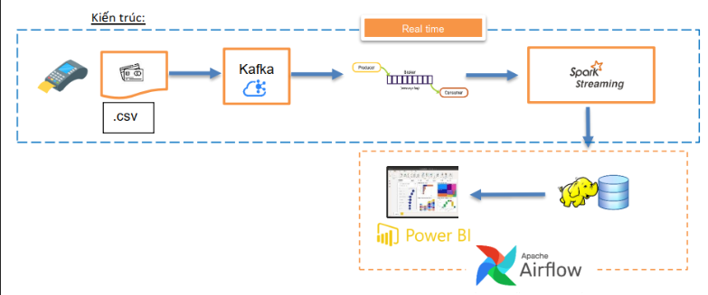
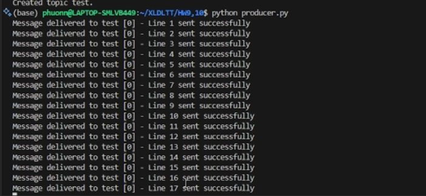
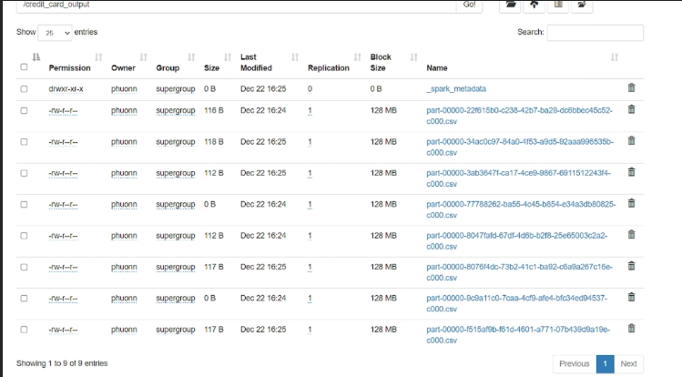
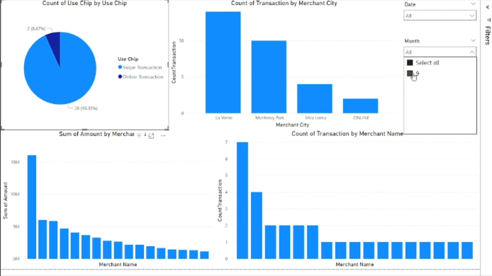
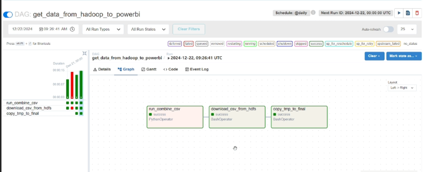

# Project_Big_Data

## System architecture 

### 1. Data Source
The data is collected from payment devices or CSV files.
The CSV files are read line by line and sent to a Kafka topic at random intervals ranging from 1 to 3 seconds.

### 2. Kafka
Kafka serves as an intermediary message queue system for real-time data transmission.
The producer reads from CSV files and sends data to a Kafka topic.  

### 3. Spark Streaming
Spark Streaming reads data from Kafka and processes it in real-time.
The processing operations include:
Filtering data, only keeping non-fraudulent transactions (Is Fraud = No).
Transforming information: converting amounts to VND, formatting transaction dates as dd/mm/yyyy, and formatting transaction times as hh:mm:ss.

### 4. Hadoop
Hadoop acts as a data storage system, preparing data for further analysis and visualization.
The processed results from Spark are stored in Hadoop HDFS as CSV files.  

### 5. Power BI
Power BI connects to the aggregated CSV file compiled from multiple CSV files stored in Hadoop.
The data is visualized through charts and summary reports to meet business requirements.  

### 6. Apache Airflow
Airflow is used to automate the aggregation of CSV files stored in Hadoop into a single file, which is then downloaded to a local machine for Power BI to connect.
The system ensures that data is updated daily.  

